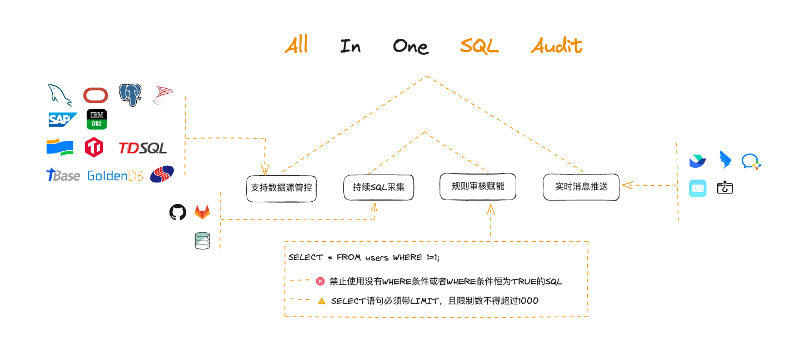
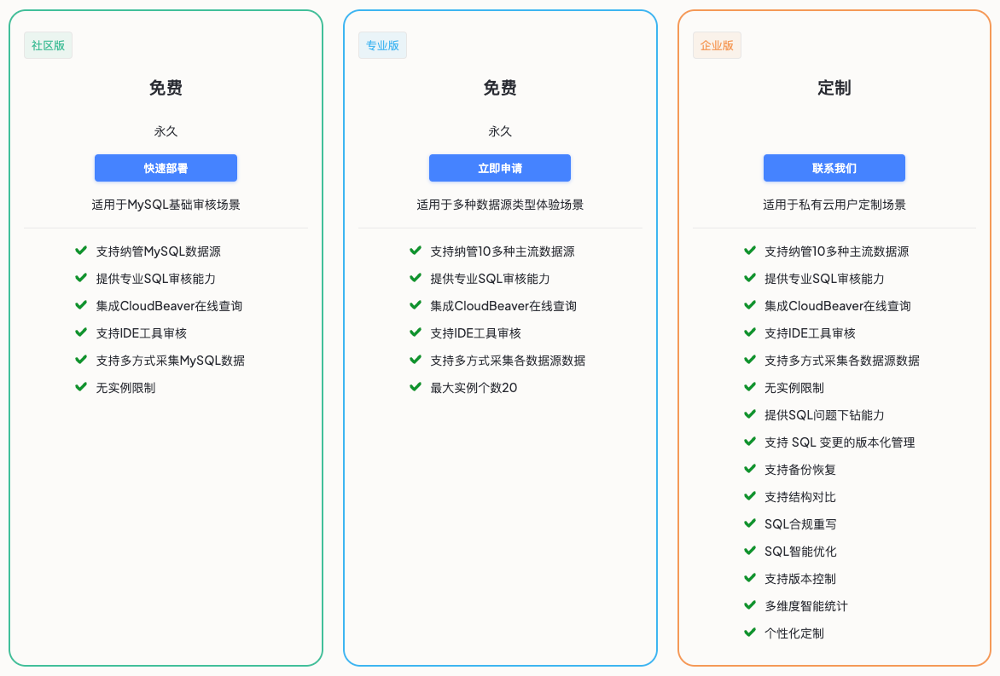

一个支持多种不同类型数据库，覆盖事前控制、事后监督、标准发布场景，帮助您建立质量规范的SQL全生命周期质量管理平台。

每周发版，快速迭代中

简体中文 | [English](./README_en.md)

# 🔍 SQLE是什么
SQLE 是爱可生自主研发支持多元数据库的 SQL 质量管理平台。应用于开发、测试、上线发布、生产运行阶段的 SQL 质量治理。通过 “建立规范、事前控制、事后监督、标准发布” 的方式，为企业提供 SQL 全生命周期质量管控能力，规避业务 SQL 不规范引起的生产事故，提高业务稳定性，也可推动企业内部开发规范快速落地。

# 📌 功能特性
### 🚀 数据库兼容主流拥抱国产

  - 主流数据库：MySQL、PostgreSQL、Oracle 等十多种数据库高度兼容。
  - 国产数据库：OceanBase、达梦、TDSQL、GoldenDB、ActionDB 等深度适配。
  - 持续扩展中……

### 🔍 专家级 SQL 诊断能力

  - 规则丰富：内置规则库超 1000 条，支持自定义规则扩展。
  - 场景匹配：覆盖性能优化/安全防护/合规审查等场景，源自各行业头部企业数据库专家的最佳实践。
  
### 🛡️ 变更安全双保险

  - 版本追踪：支持 SQL 变更的版本化管理，完美对接 DevOps 流程。
  - 备份恢复：自动生成变更备份，提供秒级数据恢复能力，显著降低误操作风险。
  
### 📊 SQL 全链路监控管家

  - 智能采集：自动抓取慢日志、业务代码等场景 SQL，7x24 小时数据库监控。
  - 深度治理：执行计划对比、索引优化建议、死锁根因分析，三招快速定位问题 SQL 并提供优化方案。
  - 趋势洞察：可视化呈现 SQL 质量变化趋势，建立优化效果可衡量的闭环机制。
  
### ⚡ 审批流水线智能便捷

  - 自定义审批流程：定制审批层级与自动化策略，减少人工介入，提升协作效率。
  - 主流办公 IM 同步：打通飞书、钉钉等 IM 平台，实时同步审核状态与上线进度。
  
### 🛠️ 研发友好的数据工作台

  - 高效率使用：快速 SQL 编辑，SQL 智能补全，批量操作。

查看更多[社区版与企业版对比](https://actiontech.github.io/sqle-docs/docs/support/compare)。

# 💡 使用场景

  
没有数据库专家，SQL 优化从何下手？

- **用审核规则找到问题**：

  SQLE 内置专家规则模板，自动扫描问题 SQL，生成可视化诊断报告，将排查时间从小时级缩短至分钟级。
  
- **从执行计划分析确认问题**

  长期跟踪分析执行数据，通过资源消耗趋势定位性能劣化原因，精准锁定问题根源。
   
- **结合专家经验解决问题**：

  问题自动匹配专家级知识库最佳实践，提供从索引优化到查询重构的完整解决方案，新手也能像专家一样调优。
  

  
数据变更总出问题，能否回滚并溯源？

- **版本变更可追踪**

  可视化展示 SQL 完整变更历史，支持版本差异对比，实时掌握各团队发布进度。 

- **数据变更有保障**
  
  自动生成回滚方案，并支持预发布环境验证。已帮助 95% 的客户降低变更风险。
  

  
SQL 采集费时费力？风险 SQL 无法识别？

- **多源智能采集**

  覆盖从慢查询到应用代码的 SQL 范围，告别手动提取。
  
- **研发流程集成**

  无缝对接 Jenkins 等 CI/CD 工具，自动拦截问题 SQL。

- **智能风险预警**

  自动识别高频高资源消耗SQL，自动推送风险相关人，提高问题响应速度。

  

  
跨团队协作效率低？可视化流程全程透明 

- **一键配置工作流**

  灵活适配企业组织架构，支持飞书/钉钉/企业微信等通知，实现掌上操作。
  
- **变更实时跟踪**

  实时推送各阶段 SQL 变更动态，确保关键信息及时触达。
  

  
DBA 忙不开？开发自己来审核！

- **研发阶段自检**

  IDE 实时 SQL 规范扫描，将风险消灭于萌芽状态。
  
- **自动化质量管控**

  将 SQL 审核嵌入 CI/CD 流程，自动分析并反馈问题报告。
  

# 🧩 快速开始

## 版本说明
目前SQLE提供三个不同形态的版本，以满足不同的使用需求：

* 如您需要体验社区版，可以在[试用环境](#在线试用)中体验，或直接[本地部署](#本地安装)；
* 如您需要体验专业版功能，请在[填写问卷](https://www.wjx.cn/vm/tWgc0yP.aspx#)后获取安装包部署；
* 如您需要体验企业版功能，可以在[试用环境](#在线试用)中体验，或[联系我们的商务](#📞-商业支持)。

## 在线试用
 我们同时提供了 SQLE 社区版 和  SQLE 企业版 的线上 DEMO 环境，登录后您可以轻松体验 SQLE 的丰富功能。
 
- [SQLE 社区版](http://demo.sqle.actionsky.com/)
- [SQLE 企业版](http://demo.sqle.actionsky.com:8889/)

**登录信息**
|user|password|
|---|---|
|admin|admin|

**您可以连接MySQL实例，进行测试**

|variable|value|
|---|---|
|地址| 20.20.20.3|
|端口| 3306|
|用户| root|
|密码| test|

> 注意事项
> 1. 该服务仅用于在线功能体验，请勿在生产环境使用；
> 2. 该测试服务数据会定期清理。

## 本地安装
SQLE 提供了多种安装部署的方式，用户可以结合自己的环境和现状选择。初次体验或者测试使用的话建议使用docker-compose 或 docker 快速部署。

部署方式：

1. [源码安装](https://actiontech.github.io/sqle-docs/docs/deploy-manual/source)
2. [RPM 部署](https://actiontech.github.io/sqle-docs/docs/deploy-manual/rpm)
3. [Docker 部署](https://actiontech.github.io/sqle-docs/docs/deploy-manual/Docker)
4. [Docker Compose部署](https://actiontech.github.io/sqle-docs/docs/deploy-manual/DockerCompose)

## 插件开发
目前支持其他种类数据库的审核插件:
* [PostgreSQL](https://github.com/actiontech/sqle-pg-plugin)
* [Oracle](https://github.com/actiontech/sqle-oracle-plugin)
* [SQL Server](https://github.com/actiontech/sqle-ms-plugin)
* [DB2](https://github.com/actiontech/sqle-db2-plugin)

更多了解：《[功能说明及开发手册](https://actiontech.github.io/sqle-docs/docs/dev-manual/plugins/intro) 》

# 🧑🏻‍💻社区支持
我们感谢您的关注与贡献，社区将引导您了解如何使用和贡献。欢迎以下方式加入社区：
* [官方网站](https://opensource.actionsky.com/sqle/)
* [文档手册](https://actiontech.github.io/sqle-docs/)
* 微信交流群：请添加管理员微信 ActionOpenSource
* 微信公众号：爱可生开源社区
  
  
  
* 其他媒体 [Gitee](https://gitee.com/mirrors/SQLE?_from=gitee_search) | [思否](https://segmentfault.com/blog/sqle) | [开源中国](https://www.oschina.net/p/sqle) | [墨天轮](https://www.modb.pro/wiki/2759) | [CSDN](https://blog.csdn.net/ActionTech) | [稀土掘金](https://juejin.cn/column/7241238544252829753) | [知乎](https://www.zhihu.com/people/Actionsky-86-50/columns)

🤗 欢迎将体验中产生的 Bug、问题和需求提交到 [SQLE GitHub Issue](https://github.com/actiontech/sqle/issues)。

# 📞 商业支持
如果想获得 SQLE 的商业支持, 您可以扫描下方的微信扫描小程序码，进行在线咨询预约：

此外，您也可以直接联系我们的商业支持团队获取更多信息，联系方式如下：

400-820-6580 / 13916131869 / 18930110869
