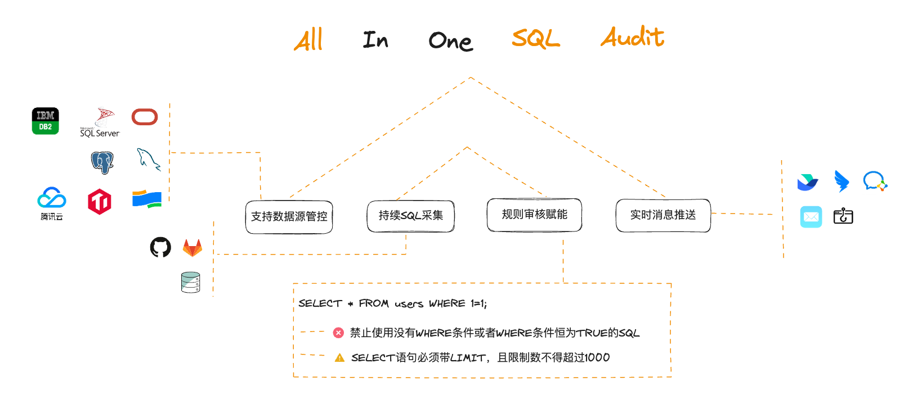
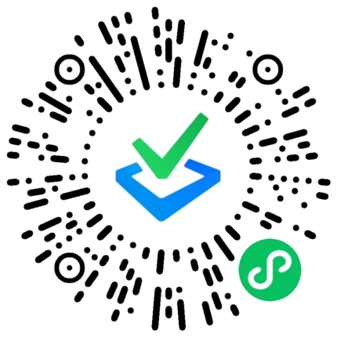

一个支持多种不同类型数据库，覆盖事前控制、事后监督、标准发布场景，帮助您建立质量规范的SQL全生命周期质量管理平台。

每周发版，快速迭代中

简体中文 | [English](./README_en.md)

# 🔍 SQLE是什么
SQLE 是爱可生自主研发支持多元数据库的 SQL 质量管理平台。应用于开发、测试、上线发布、生产运行阶段的 SQL 质量治理。通过 “建立规范、事前控制、事后监督、标准发布” 的方式，为企业提供 SQL 全生命周期质量管控能力，规避业务 SQL 不规范引起的生产事故，提高业务稳定性，也可推动企业内部开发规范快速落地。

# 📌 功能特性
### 更丰富的数据源支持

  支持主流商业和开源数据库，包括 MySQL、PostgreSQL、Oracle、SQL Server、DB2、TiDB、OceanBase 等，持续增加新的数据源类型，以满足您不同的需求。
  
### 更全面的审核规则

  审核规则源自我们经验丰富的 DBA 运维专家团队多年的技术积累。您可以借助我们的审核规则快速达到专家级的 SQL 诊断能力，并且我们的规则库目前已经拥有规则 700+，并在不断增加中。
  
### 更智能的 SQL 采集

  提供多种智能扫描方式，例如慢日志、JAVA 应用等，以满足您的事前和事后 SQL 采集需求。一旦配置完成，我们的系统会自动持续采集各业务库中的 SQL，极大地减轻了您对 SQL 监督的压力，并及时发现问题 SQL。
  
### 更高效的审批流转路径

  提供标准化的工作流，化解了在沟通和进度追踪上的难题，从而提升了上线效率。您可以通过与飞书、钉钉等多种消息通道的对接，及时了解更新进度，减少了沟通交流的成本。
  
### 更便捷的 SQL 数据操作

  集成了在线数据库客户端 CloudBeaver，无需安装，通过可视化界面进行数据库管理和查询，提升了数据操作的易用性和效率。
  
### 全生命周期的 SQL 管控

  提供 SQL 全流程的管控视角，帮助您统一管理SQL质量。您可以追踪问题SQL的解决进度，并提供快捷的优化功能，以提升 SQL 的效率。

查看更多[社区版与企业版对比](https://actiontech.github.io/sqle-docs/docs/support/compare)。

# 💡 使用场景

  
SQL 太复杂，执行性能低，如何优化？

    
  知识赋能，助您构建质量规范、提升 SQL 质量。提供审核规则及规则知识库，将专家经验赋能开发，快速提升问题 SQL 诊断能力，并支持私有云用户自主沉淀。

- **从审核结果看 SQL 优化方向**

  平台提供丰富的审核规则，用以覆盖不同 SQL 审核场景，您可以根据触发的规则，有针对性地优化 SQL。
  
- **从知识库了解问题解决经验**

  每个规则包含对应的知识库，是运维专家的经验沉淀，您可以借鉴并强化自身的运维认知。
  
- **对知识库做自主沉淀**

  除了平台提供的知识库信息，我们还支持私有云用户在知识库中进行自主沉淀，建立您的质量规范。
  

  
应用数量多，SQL 采集难，如何摆脱重复劳动？

提供智能扫描任务，可以自动持续采集不同来源的 SQL，帮助您摆脱重复劳动，极大地降低 SQL 采集难度。同时，根据不同业务要求定期巡检和生成审核报告，快速发现问题并提供优化建议。

- **配置扫描任务，释放 SQL 采集负担**

  平台支持十余种扫描任务类型，支持采集不同来源的 SQL，如：JAVA 应用程序、慢日志文件、TopSQL、MyBatis 文件等。

- **定期持续巡检，提前发现问题 SQL**
  
  平台将根据配置的采集周期，为您自动、持续采集相应 SQL。
  
  平台将根据配置的审核规则模板，定期巡检和生成审核报告，有助于您及时发现问题 SQL，并提供优化方向。
  

  
公司规模大，流程周转长，如何有效追踪进度？

  
提供标准化工作流，帮助提高工作透明度和上线效率。您可以根据实际组织架构配置自定义审批流程模板，化解沟通和进度追踪难题。同时，平台支持与多种消息通道对接，可以及时更新进度，减少沟通成本。

- **生成您的自定义审批流程**

  平台支持您根据自身实际业务，配置SQL审批、上线流程，适配不同业务的上线节奏，提升业务响应效率。
  
- **配置消息推送渠道，快捷订阅变更**

  平台支持对接多种主流IM应用，您可以将 SQL 审核集成到日常工作流中，协同办公，提升工作效率。
  

  
SQL 变更频，审批瓶颈大，如何分散审核压力？

  
将审核环节灵活嵌入到研发流程，从研发环节入手，减轻 DBA 审核压力。平台支持多种事前审核场景，将 SQL 审核前置到代码阶段，从源头实现降本增效。

- **使用 IDE 插件，前置规范检查**

  可以使用 IDE 审核插件，在代码编写过程中进行实时审核和规范检查，实现编码即审核的效果。
  
- **对接 CI/CD 流程，保证应用代码上线无忧**

  可以配置 CI/CD 审核流程，自动抓取代码变更中的 SQL，减少人工错误和代码缺陷，提高开发团队的效率和代码质量。
  

# 🧩 快速开始

## 在线试用
 我们同时提供了 SQLE 社区版 和  SQLE 企业版 的线上 DEMO 环境，登录后您可以轻松体验 SQLE 的丰富功能。
 
- [SQLE 社区版](http://demo.sqle.actionsky.com/)
- [SQLE 企业版](http://demo.sqle.actionsky.com:8889/)

**登录信息**
|user|password|
|---|---|
|admin|admin|

**您可以连接MySQL实例，进行测试**

|variable|value|
|---|---|
|地址| 20.20.20.3|
|端口| 3306|
|用户| root|
|密码| test|

> 注意事项
> 1. 该服务仅用于在线功能体验，请勿在生产环境使用；
> 2. 该测试服务数据会定期清理。

## 本地安装
SQLE 提供了多种安装部署的方式，用户可以结合自己的环境和现状选择。初次体验或者测试使用的话建议使用docker-compose 或 docker 快速部署。

部署方式：

1. [源码安装](https://actiontech.github.io/sqle-docs/docs/deploy-manual/source)
2. [RPM 部署](https://actiontech.github.io/sqle-docs/docs/deploy-manual/rpm)
3. [Docker 部署](https://actiontech.github.io/sqle-docs/docs/deploy-manual/Docker)
4. [Docker Compose部署](https://actiontech.github.io/sqle-docs/docs/deploy-manual/DockerCompose)

## 插件开发
目前支持其他种类数据库的审核插件:
* [PostgreSQL](https://github.com/actiontech/sqle-pg-plugin)
* [Oracle](https://github.com/actiontech/sqle-oracle-plugin)
* [SQL Server](https://github.com/actiontech/sqle-ms-plugin)
* [DB2](https://github.com/actiontech/sqle-db2-plugin)

更多了解：《[功能说明及开发手册](https://actiontech.github.io/sqle-docs/docs/dev-manual/plugins/intro) 》

# 🧑🏻‍💻社区支持
我们感谢您的关注与贡献，社区将引导您了解如何使用和贡献。欢迎以下方式加入社区：
* [官方网站](https://opensource.actionsky.com/sqle/)
* [文档手册](https://actiontech.github.io/sqle-docs/)
* 微信交流群：请添加管理员微信 ActionOpenSource
* 微信公众号：爱可生开源社区
  
  
  
* 其他媒体 [Gitee](https://gitee.com/mirrors/SQLE?_from=gitee_search) | [思否](https://segmentfault.com/blog/sqle) | [开源中国](https://www.oschina.net/p/sqle) | [墨天轮](https://www.modb.pro/wiki/2759) | [CSDN](https://blog.csdn.net/ActionTech) | [稀土掘金](https://juejin.cn/column/7241238544252829753) | [知乎](https://www.zhihu.com/people/Actionsky-86-50/columns)

🤗 欢迎将体验中产生的 Bug、问题和需求提交到 [SQLE GitHub Issue](https://github.com/actiontech/sqle/issues)。

# 📞 商业支持
如果想获得 SQLE 的商业支持, 您可以扫描下方的微信扫描小程序码，进行在线咨询预约：

此外，您也可以直接联系我们的商业支持团队获取更多信息，联系方式如下：

400-820-6580 / 13916131869 / 18930110869
