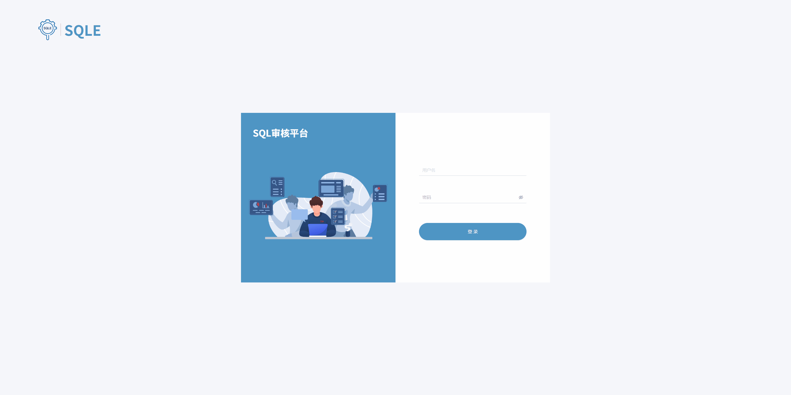

简体中文 | [English](./README_en.md)

SQLE由上海爱可生信息技术股份有限公司（以下简称爱可生公司）出品和维护，是爱可生公司“云树SQL审核软件”（简称：CTREE SQLE）软件产品的开源版本。SQLE 是一个支持多场景，原生支持 MySQL 审核且数据库类型可扩展的 SQL 审核工具。

[官方网站](https://opensource.actionsky.com/sqle/) | [文档](https://actiontech.github.io/sqle-docs-cn/) | [安装](https://actiontech.github.io/sqle-docs-cn/2.deploy/overview.html) | [在线体验](https://actiontech.github.io/sqle-docs-cn/0.overview/1_online_demo.html)

## 产品展示[[更多]](https://actiontech.github.io/sqle-docs-cn/0.overview/2_product_show.html)

## 产品特色
1. 支持SQL审核上线的工单审批流程；
2. 支持事前事中事后多场景审核；
3. 支持通过插件的形式扩展可审核上线的数据库类型；
4. 支持标准的 HTTP API，可与其他内部流程系统对接。

## 在线体验
[在线 SQLE Server](http://124.70.158.246:8888/)
#### 登录用户
* 超级管理员: admin
* 密码： admin
#### 测试 MySQL
* 地址：20.20.20.3
* 端口：3306
* 用户：root
* 密码：test
#### 注意事项
1. 该服务仅用于在线功能体验，请勿在生产环境使用；
2. 该测试服务数据会定期清理。

## SQL 审核插件
These [SQL audit plugins](https://actiontech.github.io/sqle-docs-cn/3.modules/3.7_auditplugin/overview.html) are designed to support other databases.
* [PostgreSQL](https://github.com/actiontech/sqle-pg-plugin)
* [Oracle](https://github.com/actiontech/sqle-oracle-plugin)
* [SQL Server](https://github.com/actiontech/sqle-ms-plugin)
* [DB2](https://github.com/actiontech/sqle-db2-plugin)

## 官方技术支持
- 代码库: [github.com/actiontech/sqle](https://github.com/actiontech/sqle)
- UI库: [github.com/actiontech/sqle-ui](https://github.com/actiontech/sqle-ui)
- 文档库: [github.com/actiontech/sqle-docs-cn](https://github.com/actiontech/sqle-docs-cn)
- 文档主页: [actiontech.github.io/sqle-docs-cn](https://actiontech.github.io/sqle-docs-cn/)
- QQ group: 637150065
- 网站：[爱可生开源社区](https://opensource.actionsky.com)
- 开源社区微信公众号

  

## 联系我们
如果想获得 SQLE 的商业支持, 您可以联系我们:
* 全国支持: 400-820-6580
* 华北地区: 86-13718877200, 王先生
* 华南地区: 86-18503063188, 曹先生
* 华东地区: 86-18930110869, 梁先生
* 西南地区: 86-13540040119, 洪先生
