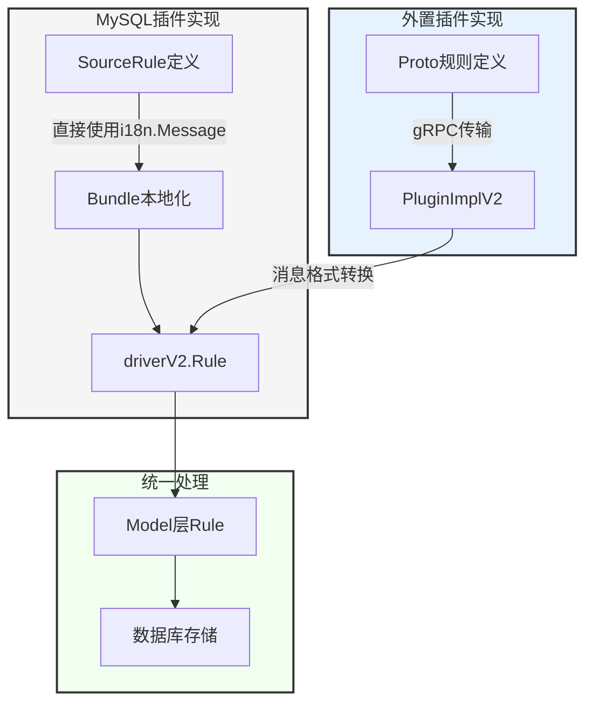

# 审核插件的国际化

前置文档：[i18nPkg README.md](https://github.com/actiontech/dms/tree/main/pkg/dms-common/i18nPkg)

## 一、插件接口定义

```go
// Plugin 接口定义了所有审核插件需要实现的方法，返回值均已支持国际化
type Plugin interface {
    // 规则审核相关
    Parse(ctx context.Context, sqlText string) ([]driverV2.Node, error)
    Audit(ctx context.Context, sqls []string) ([]*driverV2.AuditResults, error) 
    
    // 回滚
    GenRollbackSQL(ctx context.Context, sql string) (string, i18nPkg.I18nStr, error)
    
    // ... 其他方法
}
```

## 二、国际化实现方式

### 1. 国际化支持声明
```go
metas := &driverV2.DriverMetas{
    PluginName:               driverV2.DriverTypeMySQL,
    DatabaseDefaultPort:      3306,
    Logo:                     logo,
    Rules:                    rulepkg.AllRules,
    DatabaseAdditionalParams: params.Params{},
    EnabledOptionalModule: []driverV2.OptionalModule{
        ...,
        driverV2.OptionalModuleI18n, // 声明支持国际化
    },
}
```

### 2. 消息定义与初始化

#### 2.1 Bundle 初始化
```go
// locale.go
//go:embed active.*.toml
var localeFS embed.FS

var Bundle *i18nPkg.Bundle

func init() {
    b, err := i18nPkg.NewBundleFromTomlDir(localeFS, log.NewEntry())
    if err != nil {
        panic(err)
    }
    Bundle = b
}
```

#### 2.2 消息定义
```go
// message_zh.go
var (
    // 规则相关消息
    RuleDesc = &i18n.Message{
        ID: "rule_desc",
        Other: "规则描述",
    }
    
    // 审核结果消息
    SQLAuditResultDescPass = &i18n.Message{
        ID: "sql_audit_result_desc_pass",
        Other: "SQL语法检查通过",
    }
    
    // 带参数的消息
    RuleCheckFailed = &i18n.Message{
        ID: "rule_check_failed",
        Other: "规则 %s 检查未通过",
    }
)
```

### 3. 规则国际化

#### 3.1 规则定义
```go
type Rule struct {
    Name         string
    Level        RuleLevel
    I18nRuleInfo map[string]I18nRuleInfo  // 多语言规则信息
}

type I18nRuleInfo struct {
    Desc       string
    Category   string
    Annotation string
    Knowledge  Knowledge
}
```

#### 3.2 规则消息本地化
```go
// 生成多语言规则信息
func genAllI18nRuleInfo(bundle *i18nPkg.Bundle, sr *SourceRule) map[string]I18nRuleInfo {
    info := make(map[string]I18nRuleInfo)
    // 获取所有支持的语言标签
    for _, tag := range bundle.GetLanguageTags() {
        info[tag.String()] = I18nRuleInfo{
            Desc:       bundle.LocalizeMsgByLang(tag, sr.Desc),
            Category:   bundle.LocalizeMsgByLang(tag, sr.Category),
            Annotation: bundle.LocalizeMsgByLang(tag, sr.Annotation),
        }
    }
    return info
}
```

### 4. 审核结果国际化

#### 4.1 审核结果结构
```go
type AuditResults struct {
    Level           RuleLevel
    RuleName        string
    Message         i18nPkg.I18nStr        // 多语言审核消息
}
```

#### 4.2 审核结果生成
```go
func (i *MysqlDriverImpl) Audit(ctx context.Context, sqls []string) ([]*driverV2.AuditResults, error) {
    results := make([]*driverV2.AuditResults, 0, len(sqls))
    for _, sql := range sqls {
        // 生成多语言审核结果
        i.result.Add(
            rule.Level,
            rule.Name,
            plocale.Bundle.LocalizeAll(handler.Message),  // 所有语言版本
        )
        
        // 带参数的审核结果
        i.result.Add(
            rule.Level,
            rule.Name,
            plocale.Bundle.LocalizeAllWithArgs(
                plocale.RuleCheckFailed,
                rule.Name,
            ),
        )
    }
    return results, nil
}
```

### 5. 数据存储与查询

#### 5.1 数据库存储
```go
type AuditResult struct {
    gorm.Model
    TaskID   uint
    Result   i18nPkg.I18nStr `gorm:"type:json"` // JSON存储多语言内容
    Level    string
    RuleName string
}
```

#### 5.2 查询指定语言结果
```go
func GetAuditResults(ctx context.Context, taskID uint) ([]string, error) {
    var results []AuditResult
    if err := db.Where("task_id = ?", taskID).Find(&results).Error; err != nil {
        return nil, err
    }
    
    // 获取当前语言环境
    lang := locale.Bundle.GetLangTagFromCtx(ctx)
    
    // 获取指定语言的审核结果
    var messages []string
    for _, r := range results {
        msg := r.Result.GetStrInLang(lang)
        if msg != "" {
            messages = append(messages, msg)
        }
    }
    return messages, nil
}
```

## 三、外置插件的国际化实现
插件侧根据具体插件实际情况参照MySQL插件实现进行国际化，主要是国际化规则定义和审核结果。

### 1. 实现说明
外置插件（`PluginImplV2`）通过 gRPC 协议与主程序通信
```go
type PluginImplV2 struct {
    client  protoV2.DriverClient
    Session *protoV2.Session
    meta    *driverV2.DriverMetas    // 包含插件元信息和规则定义，均已支持国际化
}   
```

### 2. Protobuf 接口定义

#### 2.1 规则信息
```protobuf
message Rule {
  string name = 1;
  string desc = 2;
  string level = 3;
  map<string, I18nRuleInfo> i18nRuleInfo = 8;  // 国际化
}

message I18nRuleInfo {
  string desc = 1;
  string category = 2;
  string annotation = 3;
  Knowledge knowledge = 4;
}
```

#### 2.2 审核结果
```protobuf
message AuditResult {
  string message = 1;
  map<string, I18nAuditResultInfo> i18nAuditResultInfo = 6; // 国际化
}
```

### 4. 数据转换
```go
// Proto 消息转换为统一的 Driver 格式
func ConvertI18nRuleFromProtoToDriver(rule *protoV2.Rule, isI18n bool) (*Rule, error) {
    dRule := &Rule{
        Name:         rule.Name,
        Level:        RuleLevel(rule.Level),
        I18nRuleInfo: make(I18nRuleInfo, len(rule.I18NRuleInfo)),
    }
    // 处理国际化信息
    if isI18n {
        for lang, info := range rule.I18NRuleInfo {
        // 转换语言标签和规则信息
        }
    }
    return dRule, nil
}
```

## 四、规则国际化流程

### 1. 转换流程图



### 2. 流程说明

#### 2.1 MySQL插件内部流程
1. 从 `SourceRule` 开始，包含 `i18n.Message` 类型的多语言定义
2. 通过 `rule_i18n_converter.go` 的 `ConvertSourceRule` 函数转换
3. 生成标准的 `driverV2.Rule` 结构，包含多语言支持

#### 2.2 外部插件流程
1. 使用 Protobuf 定义规则结构
2. 通过 gRPC 接口进行传输
3. 使用 `util.go` 中的转换函数生成标准格式

#### 2.3 统一存储流程
1. 使用 `GenerateRuleByDriverRule` 进行最终转换
2. 生成 Model 层的 Rule 结构
3. 存储到数据库中

#### 2.4 数据转换要点
- MySQL插件：从 i18n.Message 转为多语言 RuleInfo
- 外部插件：从 Proto 定义转为多语言 RuleInfo
- 统一存储：转换为数据库存储格式